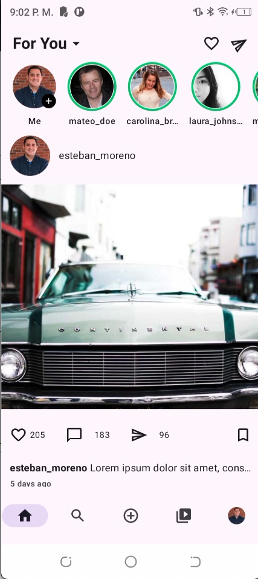
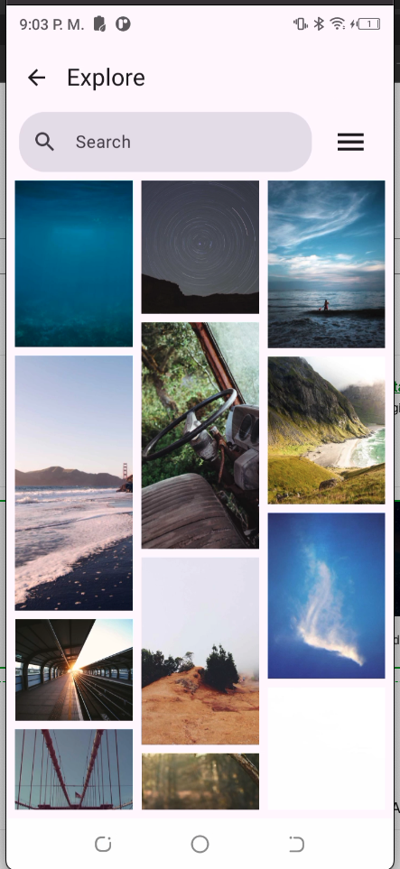
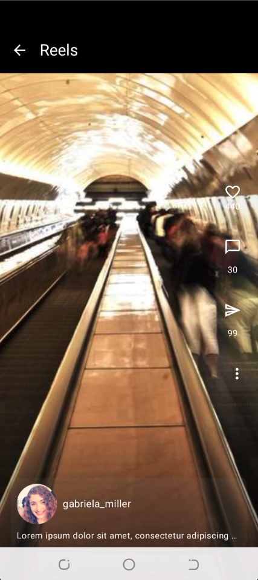
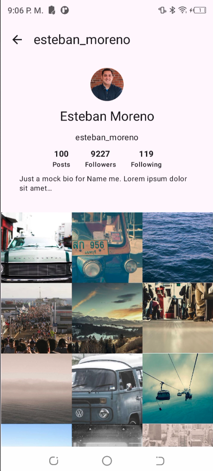

# 📸 MyInstagram Clone

Clon de Instagram desarrollado en Android utilizando Kotlin y Jetpack Compose, recreando algunas de las principales pantallas y funcionalidades de la aplicación.

---

## 📱 Descripción

Clon de Instagram desarrollado con Jetpack Compose, recreando la experiencia de navegación entre las principales secciones de la aplicación, incluyendo el feed, exploración, historias y el perfil del usuario.

## ✨ Características

- 🏠 Feed de publicaciones.
- 🔍 Pantalla de exploración de contenido.
- 📖 Visualización de historias.
- 👤 Perfil de usuario.
- 🎨 Interfaz desarrollada completamente con Jetpack Compose.

## 📸 Capturas de pantalla

|                    Feed                    |                   Explorar                    |
|:------------------------------------------:|:---------------------------------------------:|
|  |  |

|                   Historias                   |                    Perfil                     |
|:---------------------------------------------:|:---------------------------------------------:|
|  |  |

## 🛠️ Stack tecnológico

- Kotlin
- Jetpack Compose
- Android

## 📄 Licencia

Este proyecto está bajo la licencia MIT. Consulta el archivo LICENSE para más detalles.